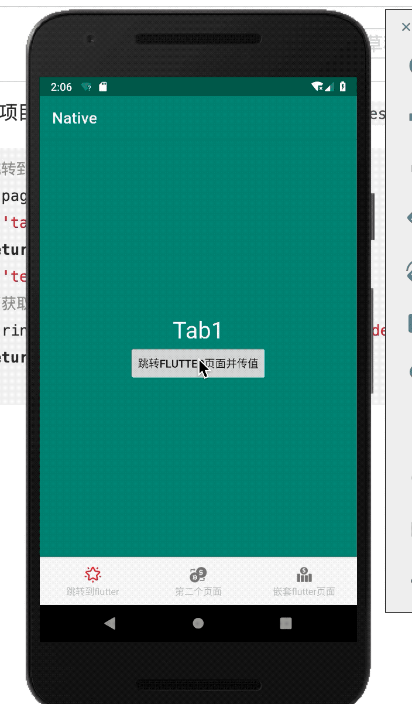

## 一、前言
Flutter自从1.0版本发布，现在越来越受欢迎，很多公司都在研究或者用在项目上。今天实践一下`Android`原生项目如何嵌套`Flutter`，具体原理就是`Flutter`作为`Android Module`出现在项目中，这样就可以在已有的项目中使用，`Android`项目也是一个工程，`Flutter`项目也是一个工程，这样就互不相关，也很好进行管理。废话不多说，开始实践。

## 二、目录结构
首先讲一下整个工程的结构:


### 1.创建Android工程
在创建Android工程前，新建一个文件夹(目录)，取名叫：mixProject，里面在创建两个文件夹分别是：flutter和native，示意图如下：**注意:后面flutter文件夹会删除，这里这是说明整个工程的目录**


下面就在native文件夹创建Android工程,`File`->`New`->`New Project`:


### 2.创建Module模式的Flutter工程
创建工程之前先把`flutte`文件夹目录删除，在`mixProject`目录下以Module形式创建Flutter工程，`File`->`New`->`New Flutter Project`,**这里要注意，选类型的要选`Flutter Module`，Flutter项目跟Android工程根文件夹是同级的，它不同于普通的Android module存在于Android工程根目录下。**


.png)

这样Android工程和Flutter工程都已经创建好了。
另外也可以通过(在项目根目录下)命令**flutter create -t module my_flutter**去创建Flutter的`Module`工程。

### 3.设置添加Flutter Module
下面在Android工程下添加对Flutter工程的依赖，在项目根目录下`setting.gradle`添加如下：
```java
//insert
setBinding(new Binding([gradle: this]))                                 // new
evaluate(new File(                                                      // new
        settingsDir.parentFile,                                               // new
        'my_flutter/.android/include_flutter.groovy'                          // new
))
```


这样要注意：`xxxx/.android/include_flutter.groovy`中的xxxx一定要和以module形式创建的Flutter工程名一致。
这时候`Sync`一下，发现Flutter的module已经添加到项目中了。

### 4.添加工程依赖
在Android工程`app`下的`build.gradle`下对Flutter的依赖:
```java
//加入Flutter的依赖
implementation project(':flutter')
```
这时候在同步一下，如果没报错，证明flutter工程已经依赖进Android工程里了，如果出现下面错误：


flutter工程和Android工程下minSdkVersion要一致。

##  三、源码简单分析
### 1. FlutterActivity
在Android原生调用Flutter页面之前，先知道`FlutterActivity`这个类，在创建的Flutter`Module`中`.android`->`app`->`flutter_module`->`host`下有个`MainActivity`,这个类是继承`FlutterActivity`类，在`AndroidManifest.xml`下并且配置了这个启动界面，也就是说当原生Android调用Flutter时，该类是Flutter项目的页面入口。那么下面看看这个类的源码，到底做了什么？


可以发现它继承了`Activity`，也就是它还是普通的`Activity`，另外还实现了三个接口：

* Provider

这个接口只有一个方法：
```java
    public interface Provider {
        FlutterView getFlutterView();
    }
```
只是返回当前`Activity`中的`FlutterView`。

* PluginRegistry
```java
public interface PluginRegistry {
    //注册插件
    PluginRegistry.Registrar registrarFor(String var1);
    //是否有这个插件
    boolean hasPlugin(String var1);
    //插件发布值
    <T> T valuePublishedByPlugin(String var1);
    //为插件注册生命回调
    public interface PluginRegistrantCallback {
        void registerWith(PluginRegistry var1);
    }
    //视图销毁监听
    public interface ViewDestroyListener {
        boolean onViewDestroy(FlutterNativeView var1);
    }
    //用户手动离开当前activity监听，如主动切换任何，按back健
    //系统自动切换应用不会调用此方法，如来电，灭屏
    public interface UserLeaveHintListener {
        void onUserLeaveHint();
    }
    //监听Activity是否执行onNewIntent的回调
    public interface NewIntentListener {
        boolean onNewIntent(Intent var1);
    }
    //监听Activity是否执行onActivityResult
    public interface ActivityResultListener {
        boolean onActivityResult(int var1, int var2, Intent var3);
    }
    //监听Activity是否请求权限的回调
    public interface RequestPermissionsResultListener {
        boolean onRequestPermissionsResult(int var1, String[] var2, int[] var3);
    }

    //插件的注册者
    public interface Registrar {
        //插件宿主的activity
        Activity activity();
        //插件的上下文 Application Context
        Context context();
        //这是当前Activity的context
        Context activeContext();
        //信使 主要用来注册Platform channels
        BinaryMessenger messenger();
        //返回TextureRegistry 可以拿到SurfaceTexture
        TextureRegistry textures();
        //返回PlatformViewRegistry
        PlatformViewRegistry platformViewRegistry();
        //返回FlutterView
        FlutterView view();
        //根据key来寻找资源
        String lookupKeyForAsset(String var1);
        //同理根据key来寻找资源
        String lookupKeyForAsset(String var1, String var2);
        //发布值
        PluginRegistry.Registrar publish(Object var1);
        //增加回调
        PluginRegistry.Registrar addRequestPermissionsResultListener(PluginRegistry.RequestPermissionsResultListener var1);
        //增加回调
        PluginRegistry.Registrar addActivityResultListener(PluginRegistry.ActivityResultListener var1);
        //增加回调newIntent回调
        PluginRegistry.Registrar addNewIntentListener(PluginRegistry.NewIntentListener var1);
        //增加回调
        PluginRegistry.Registrar addUserLeaveHintListener(PluginRegistry.UserLeaveHintListener var1);
        //增加回调视图销毁
        PluginRegistry.Registrar addViewDestroyListener(PluginRegistry.ViewDestroyListener var1);
    }
}

```

* ViewFactory
```java
    //视图工厂
    public interface ViewFactory {
        //创建FlutterView
        FlutterView createFlutterView(Context var1);
        //创建FlutterNativeView
        FlutterNativeView createFlutterNativeView();
        //是否保留FlutterNativeView
        boolean retainFlutterNativeView();
    }
```
也就是`FlutterActivity`实现上面三个接口主要是创建视图，返回视图以及监听生命周期的回调。下面回到`FlutterActivity`，`FLutterActivityDelegate`后面再分析:
```java
    //创建委托类FlutterActivityDelegate对象
    private final FlutterActivityDelegate delegate = new FlutterActivityDelegate(this, this);
    private final FlutterActivityEvents eventDelegate;
    private final Provider viewProvider;
    private final PluginRegistry pluginRegistry;
    //构造函数
    public FlutterActivity() {
        //FlutterActivityDelegate实现了FlutterActivityEvents，Provider，PluginRegistry 赋值对应的变量，调用更加清晰
        this.eventDelegate = this.delegate;
        this.viewProvider = this.delegate;
        this.pluginRegistry = this.delegate;
    }
```
并且`Activity`的生命周期函数都是由`FlutterActivityEvents`对象来执行：
```java
  protected void onCreate(Bundle savedInstanceState) {
        super.onCreate(savedInstanceState);
        this.eventDelegate.onCreate(savedInstanceState);
    }

    protected void onStart() {
        super.onStart();
        this.eventDelegate.onStart();
    }

    protected void onResume() {
        super.onResume();
        this.eventDelegate.onResume();
    }

    protected void onDestroy() {
        this.eventDelegate.onDestroy();
        super.onDestroy();
    }

    public void onBackPressed() {
        if (!this.eventDelegate.onBackPressed()) {
            super.onBackPressed();
        }

    }

    protected void onStop() {
        this.eventDelegate.onStop();
        super.onStop();
    }

    protected void onPause() {
        super.onPause();
        this.eventDelegate.onPause();
    }

    protected void onPostResume() {
        super.onPostResume();
        this.eventDelegate.onPostResume();
    }

    public void onRequestPermissionsResult(int requestCode, @NonNull String[] permissions, @NonNull int[] grantResults) {
        this.eventDelegate.onRequestPermissionsResult(requestCode, permissions, grantResults);
    }

    protected void onActivityResult(int requestCode, int resultCode, Intent data) {
        if (!this.eventDelegate.onActivityResult(requestCode, resultCode, data)) {
            super.onActivityResult(requestCode, resultCode, data);
        }

    }

    protected void onNewIntent(Intent intent) {
        this.eventDelegate.onNewIntent(intent);
    }

    public void onUserLeaveHint() {
        this.eventDelegate.onUserLeaveHint();
    }

    public void onTrimMemory(int level) {
        this.eventDelegate.onTrimMemory(level);
    }

    public void onLowMemory() {
        this.eventDelegate.onLowMemory();
    }

    public void onConfigurationChanged(Configuration newConfig) {
        super.onConfigurationChanged(newConfig);
        this.eventDelegate.onConfigurationChanged(newConfig);
    }
```
下面看看创建`FlutterView`以及返回`FlutterView`的方法：
```java
    public FlutterView getFlutterView() {
        //通过FlutterActivityDelegate委托执行
        return this.viewProvider.getFlutterView();
    }
    //子类实现 返回null
    public FlutterView createFlutterView(Context context) {
        return null;
    }
    //子类实现 返回null
    public FlutterNativeView createFlutterNativeView() {
        return null;
    }
```

插件管理的方法实现：
```java
    public final boolean hasPlugin(String key) {
        //也是通过FlutterActivityDelegate委托执行
        return this.pluginRegistry.hasPlugin(key);
    }

    public final <T> T valuePublishedByPlugin(String pluginKey) {
        return this.pluginRegistry.valuePublishedByPlugin(pluginKey);
    }

    public final Registrar registrarFor(String pluginKey) {
        return this.pluginRegistry.registrarFor(pluginKey);
    }
```
那么这里很清晰地知道`FlutterActivity`的生命周期各个方法实际由`FlutterActivityDelegate`代理执行，并且知道`FlutterActivity`通过委托代理的方式解决来生命周期的回调，插件管理和`FlutterView`的创建，是`Android`原生调`Flutter`页面的中间桥梁。

### 2. FlutterActivityDelegate
经过上面的分析，`FlutterActivityDelegate`作为委托的角色存在，下面更进一步地去深入：
```java
    public FlutterActivityDelegate(Activity activity, FlutterActivityDelegate.ViewFactory viewFactory) {
        this.activity = (Activity)Preconditions.checkNotNull(activity);
        this.viewFactory = (FlutterActivityDelegate.ViewFactory)Preconditions.checkNotNull(viewFactory);
    }
```
`FlutterActivityDelegate`构造函数需要传入`Activity`对象和`FlutterActivityDelegate.ViewFactory`，其实重点看`Activity`对象就行，因为传递给委托类`FlutterActivityDelegate`的`ViewFactory`并没有生成`FlutterView`，恰好相反，`FlutterView`是通过传递进来的`Activity`来生成的。在`FlutterActivityDelegate`类源码可以看到，定义类和`Activity`同名的函数，如：onCreate，onPause，onStart，onResume。在`FlutterActivity`中调用这个委托类同名函数，因此得出`Flutter`页面是由该委托类处理的。下面具体看一下`onCreate`方法：
```java
    public void onCreate(Bundle savedInstanceState) {
        if (VERSION.SDK_INT >= 21) {
            Window window = this.activity.getWindow();
            window.addFlags(-2147483648);
            window.setStatusBarColor(1073741824);
            window.getDecorView().setSystemUiVisibility(1280);
        }
        //获取启动参数
        String[] args = getArgsFromIntent(this.activity.getIntent());
        //保证FlutterMain初始化完成
        FlutterMain.ensureInitializationComplete(this.activity.getApplicationContext(), args);
        //注意这里，在FlutterActivity默认返回null的
        this.flutterView = this.viewFactory.createFlutterView(this.activity);
        //所以会走到这里
        if (this.flutterView == null) {
            //这里也是创建类空FlutterNativeView
            FlutterNativeView nativeView = this.viewFactory.createFlutterNativeView();
            //这里才是实际创建了FlutterView
            this.flutterView = new FlutterView(this.activity, (AttributeSet)null, nativeView);
            //设置布局参数，添加到当前activity，作为主视图
            this.flutterView.setLayoutParams(matchParent);
            this.activity.setContentView(this.flutterView);
            //创建启动ui
            this.launchView = this.createLaunchView();
            if (this.launchView != null) {
                this.addLaunchView();
            }
        }
        //根据activity获取intent中传递的路由值
        if (!this.loadIntent(this.activity.getIntent())) {
            //获取路由值 去跳转flutter项目设定的route对应页面
            //查找bundle
            String appBundlePath = FlutterMain.findAppBundlePath(this.activity.getApplicationContext());
            if (appBundlePath != null) {
                this.runBundle(appBundlePath);
            }

        }
    }
```
上面的步骤就是：
* 根据当前系统版本来设置沉浸式状态栏；
* 获取打开Activity时通过intent传入的参数信息；
* 执行FlutterMain的ensureInitializationComplete方法;
* 创建FlutterNativeView；
* 根据FlutterNativeView创建FlutterView；
* 将FlutterView设置为activity的内容视图；
* 通过FlutterMain查找appBundle所在路径，并执行appBundle；
从上面可以得知，`FlutterActivityDelegate`这个类的`onCreate`方法主要是创建`FlutterView`并且设置到`Activity`上，然后通过`loadIntent`方法去读取`intent`中传递的路由值去跳转到`Flutter`项目中对应的页面去。

### 3.FlutterView
上面讲述道`Activity`会将`FlutterView`设置到`setContView`里，下面简单看看`FlutterView`源码：
```java
public class FlutterView extends SurfaceView implements BinaryMessenger, TextureRegistry
```
看到`FlutterView`继承了`SurfaceView`，至于为什么要继承`SurfaceView`，因为`SurfaceView`使用的绘图线程不是UI线程，平时需要图形性能比较高的场景就得需要它了。
```java
public class FlutterView extends SurfaceView implements BinaryMessenger, TextureRegistry {
    private final NavigationChannel navigationChannel;
    private final KeyEventChannel keyEventChannel;
    private final LifecycleChannel lifecycleChannel;
    private final LocalizationChannel localizationChannel;
    //构造函数
    public FlutterView(Context context) {
        this(context, (AttributeSet)null);
    }

    public FlutterView(Context context, AttributeSet attrs) {
        this(context, attrs, (FlutterNativeView)null);
    }

    public FlutterView(Context context, AttributeSet attrs, FlutterNativeView nativeView) {
        super(context, attrs);
        this.nextTextureId = new AtomicLong(0L);
        this.mIsSoftwareRenderingEnabled = false;
        this.onAccessibilityChangeListener = new OnAccessibilityChangeListener() {
            public void onAccessibilityChanged(boolean isAccessibilityEnabled, boolean isTouchExplorationEnabled) {
                FlutterView.this.resetWillNotDraw(isAccessibilityEnabled, isTouchExplorationEnabled);
            }
        };
        Activity activity = getActivity(this.getContext());
        if (activity == null) {
            throw new IllegalArgumentException("Bad context");
        } else {
            //如果传递的FlutterNativeView是空
            if (nativeView == null) {
                //重新创建默认的FlutterNativeView
                this.mNativeView = new FlutterNativeView(activity.getApplicationContext());
            } else {
                this.mNativeView = nativeView;
            }

            this.dartExecutor = this.mNativeView.getDartExecutor();
            this.flutterRenderer = new FlutterRenderer(this.mNativeView.getFlutterJNI());
            this.mIsSoftwareRenderingEnabled = FlutterJNI.nativeGetIsSoftwareRenderingEnabled();
            //适配窗口变化，并在合适的时候更新mMetrics，设置到native中
            this.mMetrics = new FlutterView.ViewportMetrics();
            this.mMetrics.devicePixelRatio = context.getResources().getDisplayMetrics().density;

        }
    }
}
```
下面重点观察`NavigationChannel`这个导航Channel：
```java
public class NavigationChannel {
    @NonNull
    public final MethodChannel channel;

    public NavigationChannel(@NonNull DartExecutor dartExecutor) {
        //创建MethodChannel
        this.channel = new MethodChannel(dartExecutor, "flutter/navigation", JSONMethodCodec.INSTANCE);
    }
    //设置初始路由
    public void setInitialRoute(String initialRoute) {
        this.channel.invokeMethod("setInitialRoute", initialRoute);
    }
    //将指定路由压入栈
    public void pushRoute(String route) {
        this.channel.invokeMethod("pushRoute", route);
    }
    //将指定路由弹出栈
    public void popRoute() {
        this.channel.invokeMethod("popRoute", (Object)null);
    }
    //设置MethodCallHandler
    public void setMethodCallHandler(@Nullable MethodCallHandler handler) {
        this.channel.setMethodCallHandler(handler);
    }
}
```
也就是说`FlutterView`导航是通过`MethodChannel`与`Flutter`进行通信，最终交由`Flutter`处理。做个插件都知道，在`Flutter`肯定存在`MethodChannel('flutter/navigation',JSONMethodCodec)`，在`ststem_channels.dart`中找到：
```java
  /// A JSON [MethodChannel] for navigation.
  ///
  /// The following incoming methods are defined for this channel (registered
  /// using [MethodChannel.setMethodCallHandler]):
  ///
  ///  * `popRoute`, which is called when the system wants the current route to
  ///    be removed (e.g. if the user hits a system-level back button).
  ///
  ///  * `pushRoute`, which is called with a single string argument when the
  ///    operating system instructs the application to open a particular page.
  ///
  /// See also:
  ///
  ///  * [WidgetsBindingObserver.didPopRoute] and
  ///    [WidgetsBindingObserver.didPushRoute], which expose this channel's
  ///    methods.
  static const MethodChannel navigation = MethodChannel(
      'flutter/navigation',
      JSONMethodCodec(),
  );
```
并且在`widgets/binding.dart`找到对应实现：
```java
  Future<dynamic> _handleNavigationInvocation(MethodCall methodCall) {
    switch (methodCall.method) {
      case 'popRoute':
        //压入栈
        return handlePopRoute();
      case 'pushRoute':
        //出栈
        return handlePushRoute(methodCall.arguments);
    }
    return Future<dynamic>.value();
  }
```
但是没有看到`setInitialRoute`处理，那么在哪里会用到呢？在`app.dart`下：
```java
 /// The [MaterialApp] configures the top-level [Navigator] to search for routes
 /// in the following order:
 ///
 ///  1. For the `/` route, the [home] property, if non-null, is used.
 ///
 ///  2. Otherwise, the [routes] table is used, if it has an entry for the route.
 ///
 ///  3. Otherwise, [onGenerateRoute] is called, if provided. It should return a
 ///     non-null value for any _valid_ route not handled by [home] and [routes].
 ///
 ///  4. Finally if all else fails [onUnknownRoute] is called.
 ///
 /// If a [Navigator] is created, at least one of these options must handle the
 /// `/` route, since it is used when an invalid [initialRoute] is specified on
 /// startup (e.g. by another application launching this one with an intent on
 /// Android; see [Window.defaultRouteName]).
 ///
 /// This widget also configures the observer of the top-level [Navigator] (if
 /// any) to perform [Hero] animations.
 ///
 /// If [home], [routes], [onGenerateRoute], and [onUnknownRoute] are all null,
 /// and [builder] is not null, then no [Navigator] is created.
 /// {@macro flutter.widgets.widgetsApp.initialRoute}
  final String initialRoute;
```
上面说明了`Natvigator`配置寻找路由顺序：
* 1.对于"/"路由，如果[home]属性不为空，则会使用
* 2.否则，将会使用路由表(如果有路由条目)
* 3.否则，将会调用[onGenerateRoute]提供一个有效没有被[home]和[routes]处理的路由
* 4.最后，如果前面寻找失败，则调用[onUnknownRoute]
再查看`widgetsApp`下具体说明：
```java
  /// {@template flutter.widgets.widgetsApp.initialRoute}
  /// The name of the first route to show, if a [Navigator] is built.
  ///
  /// Defaults to [Window.defaultRouteName], which may be overridden by the code
  /// that launched the application.
  ///
  /// If the route contains slashes, then it is treated as a "deep link", and
  /// before this route is pushed, the routes leading to this one are pushed
  /// also. For example, if the route was `/a/b/c`, then the app would start
  /// with the three routes `/a`, `/a/b`, and `/a/b/c` loaded, in that order.
  ///
  /// If any part of this process fails to generate routes, then the
  /// [initialRoute] is ignored and [Navigator.defaultRouteName] is used instead
  /// (`/`). This can happen if the app is started with an intent that specifies
  /// a non-existent route.
  /// The [Navigator] is only built if routes are provided (either via [home],
  /// [routes], [onGenerateRoute], or [onUnknownRoute]); if they are not,
  /// [initialRoute] must be null and [builder] must not be null.
  ///
  /// See also:
  ///
  ///  * [Navigator.initialRoute], which is used to implement this property.
  ///  * [Navigator.push], for pushing additional routes.
  ///  * [Navigator.pop], for removing a route from the stack.
  /// {@endtemplate}
  final String initialRoute;
```
如果生成了[navigator],则**initialRoute**是第一个展示的默认路由，默认是**Window.defaultRouteName**，而在**window.dart**对**defaultName**更进一步的说明：
```java
  /// The route or path that the embedder requested when the application was
  /// launched.
  ///
  /// This will be the string "`/`" if no particular route was requested.
  ///
  /// ## Android
  ///
  /// On Android, calling
  /// [`FlutterView.setInitialRoute`](/javadoc/io/flutter/view/FlutterView.html#setInitialRoute-java.lang.String-)
  /// will set this value. The value must be set sufficiently early, i.e. before
  /// the [runApp] call is executed in Dart, for this to have any effect on the
  /// framework. The `createFlutterView` method in your `FlutterActivity`
  /// subclass is a suitable time to set the value. The application's
  /// `AndroidManifest.xml` file must also be updated to have a suitable
  /// [`<intent-filter>`](https://developer.android.com/guide/topics/manifest/intent-filter-element.html).
  ///
  /// ## iOS
  ///
  /// On iOS, calling
  /// [`FlutterViewController.setInitialRoute`](/objcdoc/Classes/FlutterViewController.html#/c:objc%28cs%29FlutterViewController%28im%29setInitialRoute:)
  /// will set this value. The value must be set sufficiently early, i.e. before
  /// the [runApp] call is executed in Dart, for this to have any effect on the
  /// framework. The `application:didFinishLaunchingWithOptions:` method is a
  /// suitable time to set this value.
  ///
  /// See also:
  ///
  ///  * [Navigator], a widget that handles routing.
  ///  * [SystemChannels.navigation], which handles subsequent navigation
  ///    requests from the embedder.
  String get defaultRouteName => _defaultRouteName();
  String _defaultRouteName() native 'Window_defaultRouteName';
```
注释的意思如果没有特定的路由，默认是**/**和**Android**和**IOS**如何设置该值方式和时机，现在在回到`FlutterView`里：
```java
    public void setInitialRoute(String route) {
        this.navigationChannel.setInitialRoute(route);
    }
```
到这里，已经清楚`Flutter`如何接受`native`传递的路由参数过程了。就是通过`FlutterView`可以设置该路由值，在`native`创建`FlutterView`并且通过`setInitialRoute`方法设置`route`(window.defaultRouteName)，`Flutter`通过`window.defaultRouteName`从而知道`native`要跳转到`Flutter`项目的哪个页面。
这里再回到`FlutterView`的构造函数中可能会有疑惑：为什么要创建`FlutterNativeView`呢？那下面简单看看`FlutterNativeView`的源码：

### 4.FlutterNativeView
```java
public class FlutterNativeView implements BinaryMessenger {
    private static final String TAG = "FlutterNativeView";
    //插件管理
    private final FlutterPluginRegistry mPluginRegistry;
    private final DartExecutor dartExecutor;
    private FlutterView mFlutterView;
    private final FlutterJNI mFlutterJNI;
    private final Context mContext;
    private boolean applicationIsRunning;

    public FlutterNativeView(@NonNull Context context) {
        this(context, false);
    }

    public FlutterNativeView(@NonNull Context context, boolean isBackgroundView) {
        this.mContext = context;
        this.mPluginRegistry = new FlutterPluginRegistry(this, context);
        //创建FlutterJNI
        this.mFlutterJNI = new FlutterJNI();
        this.mFlutterJNI.setRenderSurface(new FlutterNativeView.RenderSurfaceImpl());
        this.dartExecutor = new DartExecutor(this.mFlutterJNI);
        this.mFlutterJNI.addEngineLifecycleListener(new FlutterNativeView.EngineLifecycleListenerImpl());
        this.attach(this, isBackgroundView);
        this.assertAttached();
    }
}
```
可以看到`FlutterNativeView`实现了`BinaryMessenger`接口，根据其意思可以得知，这个BinaryMessenger是一个数据信息交流对象，接口声明如下：
```java
public interface BinaryMessenger {
    void send(String var1, ByteBuffer var2);

    void send(String var1, ByteBuffer var2, BinaryMessenger.BinaryReply var3);

    void setMessageHandler(String var1, BinaryMessenger.BinaryMessageHandler var2);

    public interface BinaryReply {
        void reply(ByteBuffer var1);
    }

    public interface BinaryMessageHandler {
        void onMessage(ByteBuffer var1, BinaryMessenger.BinaryReply var2);
    }
}
```
这是用于`Flutter`和`Native`之间交换数据的接口类，已知`FlutterView`已经实现了`SurfaceView`，而`FlutterNativeView`负责`FlutterView`和`Flutter`之间的通讯，再使用`Skia`绘制页面。

下面再看看`FlutterJNI`这个类：
```java
public class FlutterJNI {
    ...
    public FlutterJNI() {
    }
    private native void nativeDestroy(long var1);
    
    private native long nativeAttach(FlutterJNI var1, boolean var2);
        private static native void nativeDetach(long var0);

    private static native void nativeRunBundleAndSnapshot(long var0, String var2, String var3, String var4, boolean var5, AssetManager var6);

    private static native void nativeRunBundleAndSource(long var0, String var2, String var3, String var4);

    private static native void nativeSetAssetBundlePathOnUI(long var0, String var2);

    private static native String nativeGetObservatoryUri();

    private static native void nativeDispatchEmptyPlatformMessage(long var0, String var2, int var3);

    private static native void nativeDispatchPlatformMessage(long var0, String var2, ByteBuffer var3, int var4, int var5);
}
```
发现涉及到很多和native打交道的方法，可以知道`NativeView`显然是一个插件、消息的管理类，并与native打交道，那么和`FlutterView`的关系，显然一个负责展示，一个负责交互。

### 5.loadIntent
在上面分析`FlutterActivity`实现了`getFlutterView`方法，也分析到在FlutterActivityDelegate创建了`FlutterView`并添加到当前`Activity`中。当`FlutterView`被添加到`Activity`，那么`Flutter`怎么知道`native`打开哪个页面呢，其实是通过`loadIntent`这个方法来打开对应的页面,下面具体看看这个再`FlutterActivityDelegate`这个类里的`loadIntent`方法：
```java
        //根据activity获取intent中传递的路由值
        if (!this.loadIntent(this.activity.getIntent())) {
            String appBundlePath = FlutterMain.findAppBundlePath(this.activity.getApplicationContext());
            if (appBundlePath != null) {
                this.runBundle(appBundlePath);
            }

        }
        
        .....
        
        private boolean loadIntent(Intent intent) {
        String action = intent.getAction();
        if ("android.intent.action.RUN".equals(action)) {
            String route = intent.getStringExtra("route");
            String appBundlePath = intent.getDataString();
            if (appBundlePath == null) {
               //查找bundle
                appBundlePath = FlutterMain.findAppBundlePath(this.activity.getApplicationContext());
            }

            if (route != null) {
                //flutterView初始化，参数为路由
                this.flutterView.setInitialRoute(route);
            }

            this.runBundle(appBundlePath);
            return true;
        } else {
            return false;
        }
    }

```
### 6.runBundle
```java
    //runBundle方法
    private void runBundle(String appBundlePath) {
    //第一次启动flutter页面isApplicationRunning()为false
    if (!this.flutterView.getFlutterNativeView().isApplicationRunning()) {
        FlutterRunArguments args = new FlutterRunArguments();
        ArrayList<String> bundlePaths = new ArrayList();
        //检查是否有flutter相关资源，这里用于动态更新
        ResourceUpdater resourceUpdater = FlutterMain.getResourceUpdater();
        if (resourceUpdater != null) {
            File patchFile = resourceUpdater.getInstalledPatch();
            JSONObject manifest = resourceUpdater.readManifest(patchFile);
            if (resourceUpdater.validateManifest(manifest)) {
                bundlePaths.add(patchFile.getPath());
            }
        }
        //设置对应的运行参数
        bundlePaths.add(appBundlePath);
        args.bundlePaths = (String[])bundlePaths.toArray(new String[0]);
        
        args.entrypoint = "main";
        //通过flutterView.runFromBundle()来执行
        this.flutterView.runFromBundle(args);
    }

}
```
可以看到最后通过`FlutterView`的`runFromBundle()`执行。

### 7.runFromBundle
```java
    public void runFromBundle(FlutterRunArguments args) {
        this.assertAttached();
        this.preRun();
        this.mNativeView.runFromBundle(args);
        this.postRun();
    }
```
调用`FlutterNativeView`的`runFromBundle`方法：
```java
    public void runFromBundle(FlutterRunArguments args) {
        boolean hasBundlePaths = args.bundlePaths != null && args.bundlePaths.length != 0;
        if (args.bundlePath == null && !hasBundlePaths) {
            throw new AssertionError("Either bundlePath or bundlePaths must be specified");
        } else if ((args.bundlePath != null || args.defaultPath != null) && hasBundlePaths) {
            throw new AssertionError("Can't specify both bundlePath and bundlePaths");
        } else if (args.entrypoint == null) {
            throw new AssertionError("An entrypoint must be specified");
        } else {
            if (hasBundlePaths) {
                this.runFromBundleInternal(args.bundlePaths, args.entrypoint, args.libraryPath);
            } else {
                this.runFromBundleInternal(new String[]{args.bundlePath, args.defaultPath}, args.entrypoint, args.libraryPath);
            }

        }
    }
```
当Bundle参数不为空的时候，调用`runFromBundleInternal`方法：
```java
    private void runFromBundleInternal(String[] bundlePaths, String entrypoint, String libraryPath) {
        this.assertAttached();
        if (this.applicationIsRunning) {
            throw new AssertionError("This Flutter engine instance is already running an application");
        } else {
            this.mFlutterJNI.runBundleAndSnapshotFromLibrary(bundlePaths, entrypoint, libraryPath, this.mContext.getResources().getAssets());
            this.applicationIsRunning = true;
        }
    }
```
最后通过`FlutterJNI`来调用`JNI`方法执行：
```java
    @UiThread
    public void runBundleAndSnapshotFromLibrary(@NonNull String[] prioritizedBundlePaths, @Nullable String entrypointFunctionName, @Nullable String pathToEntrypointFunction, @NonNull AssetManager assetManager) {
        this.ensureAttachedToNative();
        this.nativeRunBundleAndSnapshotFromLibrary(this.nativePlatformViewId, prioritizedBundlePaths, entrypointFunctionName, pathToEntrypointFunction, assetManager);
    }
```
* nativePlatformViewId 这是在FlutterView创建FlutterNativeView，FlutteNativeView调用FlutterJNI的natvieAttach传递给c++层，而从c++层返回，通过这个值来执行c++的一些方法。
* prioritizedBundlePaths，数组中只有一个值类似`/data/data/包名/flutter/flutter_assets/`的路径值，这就是路由值。
* entrypointFunctionName：这个值为main
* pathToEntrypointFunction：这是null

最后调用c++方法将`main`函数调起，之后就执行`widget`绑定，UI渲染等。这里发现`nativeRunBundleAndSnapshotFromLibrary`需要传四个参数。

这里可以得出，只要打开`FlutterActivity`页面的时候，通过`intent`传入的key，如果这个值于`Flutter`项目定义的route值一样，就能跳到对应的页面。下面用一张图简单描述流程：


也就是当原生打开Flutter页面的时候，其实还是跳转`Activity`，只不过这个`Activity`铺了`FlutterView`来显示，那下面具体实践。

## 四、简单例子
### 1.搭建页面
这边例子只有主页面(Activity)，主页面由一个`ViewPager`和底部`RadioGroup`组成：
```java
<?xml version="1.0" encoding="utf-8"?>
<android.support.constraint.ConstraintLayout xmlns:android="http://schemas.android.com/apk/res/android"
    xmlns:app="http://schemas.android.com/apk/res-auto"
    xmlns:tools="http://schemas.android.com/tools"
    android:layout_width="match_parent"
    android:layout_height="match_parent"
    >


    <android.support.v4.view.ViewPager
        android:id="@+id/viewpager"
        android:layout_width="match_parent"
        android:layout_height="wrap_content"
        app:layout_constraintRight_toRightOf="parent"
        app:layout_constraintLeft_toLeftOf="parent"
        app:layout_constraintTop_toTopOf="parent"
        app:layout_constraintBottom_toTopOf="@+id/view_line"/>

    <View
        android:id="@+id/view_line"
        android:layout_width="match_parent"
        android:layout_height="2dp"
        app:layout_constraintRight_toRightOf="parent"
        app:layout_constraintLeft_toLeftOf="parent"
        app:layout_constraintBottom_toTopOf="@+id/rl_bottom_radio"
        android:background="#ece7e7"/>


    <RelativeLayout
        android:id="@+id/rl_bottom_radio"
        android:layout_width="match_parent"
        android:layout_height="60dp"
        app:layout_constraintLeft_toLeftOf="parent"
        app:layout_constraintBottom_toBottomOf="parent"
        app:layout_constraintRight_toRightOf="parent"
     >


        <RadioGroup
            android:id="@+id/rg_foot_bar"
            android:layout_width="match_parent"
            android:layout_height="match_parent"
            android:orientation="horizontal">

            <RadioButton
                android:id="@+id/radio_button_one"
                style="@style/main_footer_bar_radio"
                android:checked="true"
                android:drawableTop="@drawable/widget_bar_one"
                android:text="跳转到flutter"
                />
            <RadioButton
                android:="@+id/radio_button_two"
                style="@style/main_footer_bar_radio"

                android:drawableTop="@drawable/widget_bar_two"
                android:text="测试"
                />
            <RadioButton
                android:="@+id/radio_button_three"
                style="@style/main_footer_bar_radio"
                android:drawableTop="@drawable/widget_bar_three"
                android:text="网络"
                />

            
        </RadioGroup>
        
    </RelativeLayout>

</android.support.constraint.ConstraintLayout>
```
`ViewPager`分别由三个`Fragment`组成，分别是跳到`Flutter`页面，测试页面和网络加载`Flutter`页面。
`MainActivity`:
```java
<?xml version="1.0" encoding="utf-8"?>
<LinearLayout xmlns:android="http://schemas.android.com/apk/res/android"
    xmlns:app="http://schemas.android.com/apk/res-auto"
    xmlns:tools="http://schemas.android.com/tools"
    android:layout_width="match_parent"
    android:layout_height="match_parent"
    android:orientation="vertical">


    <android.support.v4.view.ViewPager
        android:id="@+id/viewpager"
        android:layout_width="match_parent"
        android:layout_height="0dp"
        android:layout_weight="1"


        />

    <View
        android:id="@+id/view_line"
        android:layout_width="match_parent"
        android:layout_height="2dp"
        android:background="#ece7e7" />


    <RelativeLayout
        android:id="@+id/rl_bottom_radio"
        android:layout_width="match_parent"
        android:layout_height="60dp"

        >

        <RadioGroup
            android:id="@+id/rg_foot_bar"
            android:layout_width="match_parent"
            android:layout_height="60dp"
            android:orientation="horizontal">

            <RadioButton
                android:id="@+id/radio_button_one"
                style="@style/main_footer_bar_radio"
                android:checked="true"
                android:drawableTop="@drawable/widget_bar_one"
                android:text="跳转到flutter" />

            <RadioButton
                android:id="@+id/radio_button_two"
                style="@style/main_footer_bar_radio"
                android:drawableTop="@drawable/widget_bar_two"
                android:text="第二个页面" />

            <RadioButton
                android:id="@+id/radio_button_three"
                style="@style/main_footer_bar_radio"
                android:drawableTop="@drawable/widget_bar_three"
                android:text="嵌套flutter页面" />


        </RadioGroup>

    </RelativeLayout>

</LinearLayout>
```
### 2.通过Fragment嵌套Flutter
### 2.1.跳转到默认页面
在**io.flutter.facade**下自动生成了`FlutterFragment`
```java
/**
 * A {@link Fragment} managing a {@link FlutterView}.
 *
 * <p><strong>Warning:</strong> This file is auto-generated by Flutter tooling.
 * DO NOT EDIT.</p>
 */
public class FlutterFragment extends Fragment {
  public static final String ARG_ROUTE = "route";
  private String mRoute = "/";

  @Override
  public void onCreate(Bundle savedInstanceState) {
    super.onCreate(savedInstanceState);
    if (getArguments() != null) {
      mRoute = getArguments().getString(ARG_ROUTE);
    }
  }

  @Override
  public void onInflate(Context context, AttributeSet attrs, Bundle savedInstanceState) {
    super.onInflate(context, attrs, savedInstanceState);
  }

  @Override
  public FlutterView onCreateView(@NonNull LayoutInflater inflater, ViewGroup container, Bundle savedInstanceState) {
    return Flutter.createView(getActivity(), getLifecycle(), mRoute);
  }
}
```
继续点击`Flutter.createView`方法：
```java


/** 
   * 创建一个链接(FlutterVIew)将指定Activity和生命周期链接起来
   * 可选初始路由字符串用于确定显示哪个小部件，默认的初始路由是“/”
   *
   * Creates a {@link FlutterView} linked to the specified {@link Activity} and {@link Lifecycle}.
   * The optional initial route string will be made available to the Dart code (via
   * {@code window.defaultRouteName}) and may be used to determine which widget should be displayed
   * in the view. The default initialRoute is "/".
   *
   * @param activity an {@link Activity}
   * @param lifecycle a {@link Lifecycle}
   * @param initialRoute an initial route {@link String}, or null
   * @return a {@link FlutterView}
   */
  @NonNull
  public static FlutterView createView(@NonNull final Activity activity, @NonNull final Lifecycle lifecycle, final String initialRoute) {
    FlutterMain.startInitialization(activity.getApplicationContext());
    FlutterMain.ensureInitializationComplete(activity.getApplicationContext(), null);
    final FlutterNativeView nativeView = new FlutterNativeView(activity);
    final FlutterView flutterView = new FlutterView(activity, null, nativeView) {
      private final BasicMessageChannel<String> lifecycleMessages = new BasicMessageChannel<>(this, "flutter/lifecycle", StringCodec.INSTANCE);
      @Override
      public void onFirstFrame() {
        super.onFirstFrame();
        setAlpha(1.0f);
      }

      @Override
      public void onPostResume() {
        // Overriding default behavior to avoid dictating system UI via PlatformPlugin.
        lifecycleMessages.send("AppLifecycleState.resumed");
      }
    };
    if (initialRoute != null) {
      flutterView.setInitialRoute(initialRoute);
    }
    lifecycle.addObserver(new LifecycleObserver() {
      @OnLifecycleEvent(Lifecycle.Event.ON_CREATE)
      public void onCreate() {
        final FlutterRunArguments arguments = new FlutterRunArguments();
        arguments.bundlePath = FlutterMain.findAppBundlePath(activity.getApplicationContext());
        arguments.entrypoint = "main";
        flutterView.runFromBundle(arguments);
        GeneratedPluginRegistrant.registerWith(flutterView.getPluginRegistry());
      }

      @OnLifecycleEvent(Lifecycle.Event.ON_START)
      public void onStart() {
        flutterView.onStart();
      }

      @OnLifecycleEvent(Lifecycle.Event.ON_RESUME)
      public void onResume() {
        flutterView.onPostResume();
      }

      @OnLifecycleEvent(Lifecycle.Event.ON_PAUSE)
      public void onPause() {
        flutterView.onPause();
      }

      @OnLifecycleEvent(Lifecycle.Event.ON_STOP)
      public void onStop() {
        flutterView.onStop();
      }

      @OnLifecycleEvent(Lifecycle.Event.ON_DESTROY)
      public void onDestroy() {
        flutterView.destroy();
      }
    });
    flutterView.setAlpha(0.0f);
    return flutterView;
  }
```
看到这个`Flutter.createView(getActivity),getLifecycle(),mRoute`这行代码已经帮我们初始了`FlutterMain`，`FlutterNativeView`,`FlutterView`,并且返回`FlutterView`,那现在可以思考，那是不是创建这个系统生成的fragment就能嵌套`Flutter`页面了？实践一下：
```java
    private void initListener(){
        mViewPager.addOnPageChangeListener(new ViewPager.OnPageChangeListener() {
            @Override
            public void onPageScrolled(int position, float positionOffset, int positionOffsetPixels) {

            }
            //这里的逻辑是如果点击
            @Override
            public void onPageSelected(int position) {
               //如果点击第三个RadioButton
               if(position == 2){
                   //如果没有初始化就初始化FlutterFragment
                   if(isFirstInitFlutterView){
                       initFlutterFragment();
                       isFirstInitFlutterView = false;
                   }

               }
            }

            @Override
            public void onPageScrollStateChanged(int i) {

            }
        });
    }
    /**
     *
     * 初始化FlutterFragment
     *
     */
    private void initFlutterFragment(){
        mFragmentAdapter.updateFragment(2,new FlutterFragment());
        //更新Fragment
        mFragmentAdapter.notifyDataSetChanged();
    }
```
看看效果图：


可以看到只通过`new FlutterFragment`代码即可把`Flutter`页面嵌套到原生Android里。

### 2.2.跳转到指定页面
可以发现上面跳到`Flutter`项目的主页面(默认页面)，下面通过指定的参数跳到指定页面
#### 2.2.1.创建新的Fragment
为了方便，下面自己实现`FlutterFragment`:
```java
public class MyFlutterFragment extends Fragment {
    private static final String TAG = "MyFlutterFragment";
    //路由
    public static final String AGR_ROUTE = "_route_";
    //参数
    public static final String PARAMS = "_params_";
    private String mRoute = "/";
    private String mParams = "";
    private FlutterView mFlutterView;


    public static MyFlutterFragment newInstance(String route,String params){
        Bundle args = new Bundle();
        MyFlutterFragment fragment = new MyFlutterFragment();
        args.putString(MyFlutterFragment.AGR_ROUTE,route);
        args.putString(MyFlutterFragment.PARAMS,params);
        fragment.setArguments(args);
        return fragment;

    }


    @Override
    public void onCreate(@Nullable Bundle savedInstanceState){
        super.onCreate(savedInstanceState);
        if(getArguments() != null){
            mRoute = getArguments().getString(AGR_ROUTE);
            mParams = getArguments().getString(PARAMS);
            //这里拼接参数
            JSONObject jsonObject = new JSONObject();
            JSONObject pageParamsObject;

            if(!TextUtils.isEmpty(mParams)){
                try {
                    //json字符串
                    pageParamsObject = new JSONObject(mParams);
                    jsonObject.put("pageParams",pageParamsObject);
                    mRoute = mRoute + "？" + jsonObject.toString();
                    Log.d("ssd",mRoute);
                } catch (JSONException e) {
                    e.printStackTrace();
                }
            }


        }
    }


    @Nullable
    @Override
    public View onCreateView(@NonNull LayoutInflater inflater, @Nullable ViewGroup container, @Nullable Bundle savedInstanceState){
        Log.d(TAG,"onCreateView-mRoute:"+mRoute);
        mFlutterView = Flutter.createView(getActivity(),getLifecycle(),mRoute);
        //综合解决闪屏，布局覆盖问题
        mFlutterView.setZOrderOnTop(true);
        mFlutterView.setZOrderMediaOverlay(false);
        mFlutterView.getHolder().setFormat(Color.parseColor("#00000000"));

        //注册channel
       // GeneratedPluginRegistrant.registerWith(mFlutterView.getPluginRegistry());
        //返回FlutterView
        return mFlutterView;
    }
}
```
#### 2.2.2.在Flutter页面处理路由参数
先把`main.dart`文件代码所有代码删除，我这里把它作为参数解析和路由跳转：
```java
import 'package:flutter/material.dart';
import 'dart:convert';
import 'dart:io';
import 'dart:ui';
import 'package:flutter/services.dart';
import 'package:flutter_module/ui/tab_fragment.dart';

void main(){
  //接受路由参数 路由参数可以自定义规则 
  //window.defaultRouteName 就是获取native传递的路由参数
  runApp(_widgetForRoute(window.defaultRouteName));

  //runApp(_widgetForRoute("tab_fragment"));
//
//  if(Platform.isAndroid){
//    //Android同步沉浸式
//    SystemUiOverlayStyle systemUiOverlayStyle = SystemUiOverlayStyle(statusBarColor: Colors.transparent);
//    SystemChrome.setSystemUIOverlayStyle(systemUiOverlayStyle);
//
//  }


}


/**
 * 路由参数处理
 * 
 */
Widget _widgetForRoute(String route){
  print("route:" + route.toString());
  //解析路由参数
  String pageName = _getPageName(route);
  Map<String,dynamic> pageParams = json.decode(_parseNativeParams(route));
  //路由参数
  print("pageName:" + pageName.toString());
  //业务参数
  print("pageParams:" + pageParams.toString());

  //截取跳转到哪个页面参数
  switch(pageName){
    case 'tab_fragment':
       return new TabFragment();

  }


}


/**
 * 解析路由参数
 * 
 */
String _getPageName(String route){
  String pageName = route;
  if (route.indexOf("?") != -1)
      //截取?之前的字符串 表明后面带有业务参数
      pageName = route.substring(0,route.indexOf("?"));
  print("pageName:" + pageName);
  return pageName;
}

/**
 * 返回业务参数
 * 
 */
String _parseNativeParams(String route){
  Map<String,dynamic> nativeParams = {};
  if(route.indexOf("?") != -1){
    nativeParams = json.decode(route.substring(route.indexOf("?") + 1));
  }
  return nativeParams['pageParams'] ?? "{}";

}
```
`main.dart`主要是解析路由参数和业务，传参的规则是可以自定义的，我这边传参是**路由+业务参数**，由上面看到`Flutter`通过`window.defaultRouteName`得到`Android`原生所传递的参数。上面通过`_widgetForRoute`方法来跳转原生传递给`Flutter`的参数对应页面，上面例子原生传递了`tab_fragment`,在`_widgetForRoute`会进入**case 'tab_fragment'**条件里，最后跳到`tab_fragment`中：

#### 2.2.3.Flutter中tab_fragment
`tab_fragment`主要是用`dio`网络库来做一个请求网络功能
```java
import 'package:flutter/material.dart';
import 'package:dio/dio.dart';
import 'package:flutter_module/util/http_util.dart';


/**
 * 原生Fragment嵌套Flutter
 *
 */
class TabFragment extends StatefulWidget {
   String content = "Tab3";
   @override
   _TabFragmentState createState() => _TabFragmentState();
}


class _TabFragmentState extends State<TabFragment>{

  String text = "这是默认内容";

  @override
  void initState(){
    super.initState();
  }


  @override
  Widget build(BuildContext context){
    return MaterialApp(
      home: new Scaffold(
          body: new Container(
            color: Colors.greenAccent,
            child:new ListView(
              children: <Widget>[
                new Padding(padding:EdgeInsets.only(top:200)),
                new Container(
                  alignment: Alignment.center,
                  child: new Text(
                    widget.content,
                    style: new TextStyle(
                      color:Colors.white,
                      fontSize: 40,
                      fontWeight: FontWeight.normal,
                      decoration: TextDecoration.none
                    ),
                  ),
                ),

                new Padding(padding: EdgeInsets.only(top:200)),
                new Container(
                  width: 100,
                  alignment: Alignment.center,
                  child:new MaterialButton(
                    child:new Text("网络1请求测试"),
                    color: Colors.greenAccent,
                    onPressed: (){
                        //网络请求模拟
                        buttonClick();
                    },

                  )
                ),
                new Container(
                  alignment: Alignment.center,
                  child: new Text(
                    text,
                    style: new TextStyle(
                      color: Colors.white,
                      fontSize: 20,
                      fontWeight: FontWeight.normal,
                      decoration: TextDecoration.none
                    ),
                  ),
                ),
              ],
            ),
          ),
      ),
    );
  }

  /**
   * 点击网络请求
   *
   */
  void buttonClick() async {
    Response response = await HttpUtil().doGet("api/test");
    if(response != null){
      if(response.statusCode == 200){
        setState(() {
          print("请求成功-response:"+response.data.toString());
          text = response.data.toString();
        });
      } else {
        print("请求失败,请检查网络后重试");
      }

    } else {
      print("请求失败,请检查网络后重试");
    }


  }

}
```
最后调用：
```java
    /**
     *
     * 初始化FlutterFragment
     *
     */
    private void initFlutterFragment(){
        mFragmentAdapter.updateFragment(2,MyFlutterFragment.newInstance("tab_fragment","ssssss"));
        //更新Fragment
        mFragmentAdapter.notifyDataSetChanged();
    }
```
效果图如下：


点击**嵌套Flutter页面**，返现`Flutter页面`以`Fragment`形式嵌套在原生中了。

### 3.以FlutterActivity为载体
#### 3.1 继承FlutterActivity
上面分析过，可以通过`FlutterActivity`来直接跳到`Flutter`页面，从上面分析`FlutterActivityDelegate`源码我们可按照以下几个步骤来实现：

* 获取打开Activity时通过intent传入的参数信息；
* 执行FlutterMain的ensureInitializationComplete方法;
* 创建FlutterNativeView；
* 根据FlutterNativeView创建FlutterView；
* 将FlutterView设置为activity的内容视图；

```java
/**
 *
 * Android ->Flutter（FlutterActivity为载体）
 */
public class FlutterMainActivity extends FlutterActivity implements MethodChannel.MethodCallHandler{
    private static final String TAG = "FlutterMainActivity";
    private String routeStr = "";
    private static final String TOAST_CHANNEL = "com.test.native_flutter/toast";


    @Override
    protected void onCreate(Bundle savedInstance){
       super.onCreate(savedInstance);
       //执行FlutterMain初始化
       FlutterMain.startInitialization(getApplicationContext());
       //插件注册
       GeneratedPluginRegistrant.registerWith(this);
       registerCustomPlugin(this);
    }


    private void registerCustomPlugin(PluginRegistry register){
         registerMethodChannel();
    }


    private void registerMethodChannel(){
        //调用原生toast
        new MethodChannel(this.registrarFor(TOAST_CHANNEL).messenger(),TOAST_CHANNEL);
    }
    @Override
    public FlutterView createFlutterView(Context context){
        getIntentData();
        WindowManager.LayoutParams matchParent = new WindowManager.LayoutParams(-1, -1);
        //创建FlutterNativeView
        FlutterNativeView nativeView = this.createFlutterNativeView();
        //创建FlutterView
        FlutterView flutterView = new FlutterView(FlutterMainActivity.this,(AttributeSet)null,nativeView);
        //给FlutterView传递路由参数
        flutterView.setInitialRoute(routeStr);
        //FlutterView设置布局参数
        flutterView.setLayoutParams(matchParent);
        //将FlutterView设置进ContentView中,设置内容视图
        this.setContentView(flutterView);
        return flutterView;
    }
    /**
     * 获取参数信息
     * 传递给flutterVIew
     */
    private void getIntentData(){
        String route = getIntent().getStringExtra("_route_");
        String params = getIntent().getStringExtra("_params_");
        JSONObject jsonObject = new JSONObject();

        try{
            jsonObject.put("pageParams",params);
        } catch (JSONException e){
            e.printStackTrace();
        }
        //字符串是路由参数 + 业务参数
        //形式如下：test?{"pageParams":"{\"content\":\"这是测试内容\"}"}
        routeStr = route + "?" + jsonObject.toString();
        Log.d(TAG,"onCreate-route:" + route + "-params" + params);
        Log.d(TAG,"pnCreate-routeStr:" + routeStr);
    }

    /**
     * 插件要实现的方法
     * @param methodCall
     * @param result
     */
    @Override
    public void onMethodCall(MethodCall methodCall, MethodChannel.Result result) {
       switch(methodCall.method){
           case "showToast"://调用原生的toast
               String content = methodCall.argument("content");
               Toast.makeText(this, content, Toast.LENGTH_SHORT).show();
               break;
               default:
                   result.notImplemented();

       }
    }
}
```
#### 3.2 跳转到FlutterActivity
在第一个`fragment`增加跳转到这`Activity`代码：
```java
    private void initListener(){
        btnNativeToFlutter.setOnClickListener(new View.OnClickListener() {
            @Override
            public void onClick(View v) {
                //跳转到FlutterMainActivity
                Map<String,Object> map = new HashMap<>();
                //并且携带业务参数
                map.put("content","这是测试内容");
                String jsonString = new Gson().toJson(map);
                String route = "test";

                Intent intent = new Intent(getActivity(), FlutterMainActivity.class);
                intent.putExtra("_route_",route);
                intent.putExtra("_params_",jsonString);
                startActivity(intent);

            }
        });
    }

```
注意传递给`FlutterMainActivity`的路由参数是**test**,那么需要在`Flutter`增加`test`页面：

#### 3.3.指定Flutter页面
```java
class Test extends StatefulWidget{

  final String content;//wowId
  Test({this.content});

  _TestState createState() => _TestState();

}

class _TestState extends State<Test>{

  @override
  void initState(){
    super.initState();
    print('content:' + widget.content);
  }

  @override
  Widget build(BuildContext context){
    return MaterialApp(
      home:new Scaffold(
        appBar: new AppBar(
          brightness: Brightness.light,
          title: new Text(
            'Flutter',
            style: new TextStyle(fontSize: 20,color:Color(0xFF1A1A1A)),

          ),
          centerTitle: true,
          elevation: 0,
          backgroundColor: Colors.blue,
          leading: new IconButton(
            icon:new Icon(Icons.arrow_back),
            color:Color(0xFF333333),
            onPressed: (){
              closeFlutter(context);
            },
          ),
        ),
        body: new Container(
          color: Colors.white,
          child: new ListView(
            children: <Widget>[
              new Padding(padding: EdgeInsets.only(top:100)),
              new Container(
                alignment: Alignment.center,
                child: new Text(
                  widget.content,
                  style: new TextStyle(
                    color: Colors.red,
                    fontSize: 40,
                    fontWeight: FontWeight.normal,
                    decoration: TextDecoration.none
                  ),
                ),
              ),

              new Container(
                width: 100,
                alignment: Alignment.center,
                child: new MaterialButton(
                  child: new Text("打开原生的toast"),
                  color: Colors.greenAccent,
                  onPressed: (){
                    buttonClick();
                  }),
              ),
            ],
          ),
        ),
      ),
    );
  }
  //弹出toast
  void buttonClick(){
    ToastUtil.showToastInfo("哈哈哈");
  }

  //返回页面
  void closeFlutter(BuildContext context){
    NavigatorUtil.close(context);
  }
}

```

#### 3.4.配置跳转逻辑
在`Flutter`项目的`main.dart`文件配置如果路由参数是`test`的逻辑：
```java
  //截取跳转到哪个页面参数
  switch(pageName){
    case 'tab_fragment':
       return new TabFragment();
    case 'test'://test页面
       //获取业务参数
       String content = pageParams["content"] ?? "defaultContent";
       return new Test(content:content,);
  }
```

#### 3.5.效果
**debug**环境下效果如下：



可以看到`debug`下会有明显的黑屏现象，那么`release`会不会是这样呢？

**release**环境下效果如下：


可以看到`release`下原生跳转到`Flutter`没有了黑屏，且切换速度很快。

### 4.以普通Activity为载体
在第一种方式`Fragment`可以知道，`Fragment`通过在`onCreateView`方法里创建`FlutterView`并返回即可与`Flutter`交互，那么能不能在普通`Activity`通过`setContentView`方法把`FlutterView`设置显示视图，最终达到交互目的呢？下面尝试一下：
```java
/**
 * Android -> Flutter (普通Activity)
 *
 */
public class MyFlutterActivity extends AppCompatActivity implements MethodChannel.MethodCallHandler {
    private static final String TOAST_CHANNEL = "com.test.native_flutter/toast";
    private FlutterView flutterView;

    
    @Override
    protected void onCreate(@Nullable Bundle savedInstanceStae){
        super.onCreate(savedInstanceStae);

        String route = getIntent().getStringExtra("_route_");
        String params = getIntent().getStringExtra("_params_");
        JSONObject jsonObject = new JSONObject();
        try{
            jsonObject.put("pageParams",params);
        } catch(JSONException e){
            e.printStackTrace();

        }
        //创建FlutterView
        flutterView = Flutter.createView(this,getLifecycle(),route + "?" + jsonObject.toString());
        //设置显示视图
        setContentView(flutterView);
        //插件注册
        registerMethodChannel();
        
    }

    @Override
    public void onBackPressed(){
        if(flutterView != null){
            flutterView.popRoute();
        }else{
            super.onBackPressed();
        }
    }

    private void registerMethodChannel(){
        new MethodChannel(flutterView,TOAST_CHANNEL).setMethodCallHandler(this);
    }

    @Override
    public void onMethodCall(MethodCall methodCall, MethodChannel.Result result) {
        switch(methodCall.method){
            case "showToast":
                //调用原生的Toast
                String content = methodCall.argument("content");
                Toast.makeText(this,content,Toast.LENGTH_SHORT).show();
                break;
            default:
                result.notImplemented();

        }
    }
}
```


同样也是可以的。

`Flutter`跳转`native`方式就很简单了，和弹出吐司一样，在`onMethodCall`做跳转就可以了，例如：
```java
    // 自定义插件
    String CHANNEL = "xxx.plugin";
    new MethodChannel(getFlutterView(), CHANNEL).setMethodCallHandler(new MethodCallHandler() {
      @Override
      public void onMethodCall(MethodCall call, Result result) {
        if (call.method.equals("routeName")) {
          Intent intent = new Intent(MainActivity.this, HomeActivity.class);
          MainActivity.this.startActivity(intent);
          result.success("success");
        } else {
          result.notImplemented();
        }
      }
    });
```

## 五、总结
通过`native`和`Flutter`两个项目来达到混合开发的优势是互不影响，在`native`不需要考虑`Flutter`是否影响本身，并通过阅读`FlutterActivity`和`FlutterView`部分源码，通过本文可以知道下面几点：
* 1.`FlutterView`是`native`和`Flutter`的桥梁。
* 2.打开`FlutterActivity`，通过`Intent`传入具体的路由值，再由`FlutterView`通过`setInitialRoute`方法设置`Flutter`中的`window.defaultRouteName`。
* 3.在`FlutterActivityDelegate`,实现对`FlutterActivity`和`Flutter`页面的声明周期管理，`FlutterView`是继承`SurfaceView`，而`native`和`Flutter`之间的通讯是`FlutterNativeView`。

## 六、参考
[Flutter源码分析之初始化篇一(android)](https://segmentfault.com/a/1190000015753249?utm_source=tag-newest)

[Flutter笔记--Flutter页面嵌入Android Activity中](https://www.jianshu.com/p/cf7cf1b640ee)


